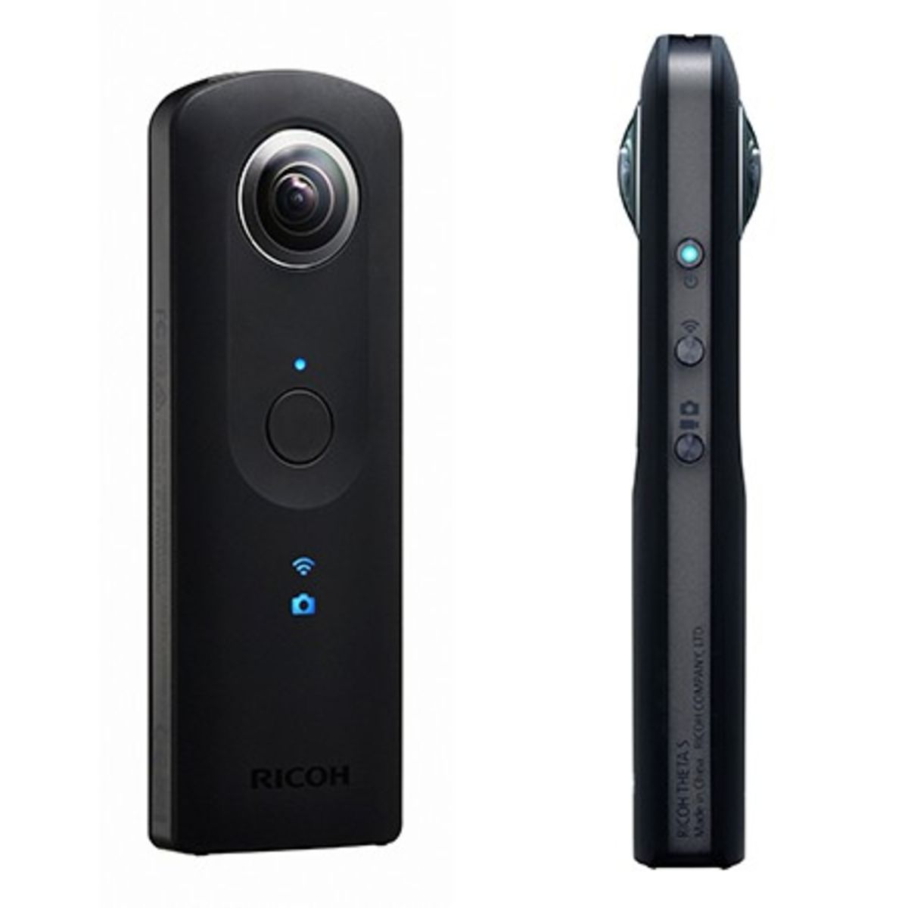
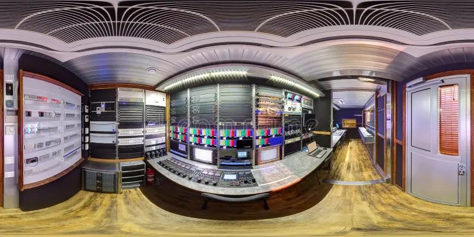
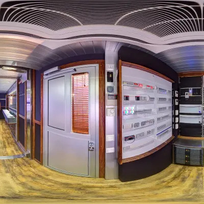
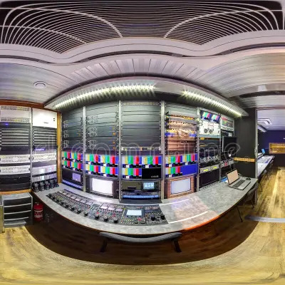

# Python Tools for Ricoh Theta S


## Description

Some Python tools to acquire images captured by a `Ricoh Theta S` camera and calibrate it. This camera is equipped with two fisheye lenses, allowing it to film in 360°.



First, you can acquire images from the two lenses with the `acquisition` module and its `main.py` script. It allows you to:
- Take pictures
- Take videos
- Get a live preview
- Access captured images and videos
- Delete all images and videos

In this module, there are many more actions available than the `main.py` script currently allows, so you can extend it and add more functionalities if needed. You just have to add some lines to the `main.py` script.

The acquired images are on equirectangle format and are splitted into two images corresponding to the two lenses of the camera, so you can work on them individually. 

{width="80%" height="80%" style="display: block; margin: 0 auto"}

<div style="width: 80%; display: flex; justify-content: space-between; margin: 0 auto">
    
    
</div>
<br>

Then, you can calibrate the two lenses with the `calibration` module and its `main.py` script, i.e., retrieve the **intrinsic** parameters (focal lengths and principal point) and **extrinsic** parameters (distortion coefficients, rotation and translation vectors) from the camera using a sample of images. This module uses an algorithm provided by `OpenCV` based on a chessboard.

Finally, you can see the acquired images on a sphere using the `projection` module and its `sphere.py` script. 


## Usage

For the **acquisition**, make sure you have connected your computer to the camera via its local Wi-Fi. To do so, press the connection button on the side of the camera. When the connection logo appears, connect the computer using the password. The password for the camera is the last 8 digits written at the bottom of the camera. The script will automatically set the correct parameters when you provide the action to perform. The ip address of the camera I used is `192.168.1.1`.

For the **calibration**, make sure you have taken enough pictures of a chessboard with the same lens. Around forty per lens is optimal because the algorithm may consider some images as invalid. The chessboard size must be `(nb_rows - 1, nb_columns - 1)` to avoid any problems.

For the **projection**, make sure to give the images acquired by the back lens and the front lens on the same format.

Run the scripts below to see all the available options:
```bash
python3 acquisition/main.py -h # or --help
python3 calibration/main.py -h # or --help
python3 projection/sphere.py -h # or --help
```

The positional argument may be a list, in this case, you have to choose only one.

Examples:

```bash
python3 acquisition/main.py get_live_preview acquisition/
# 192.168.1.1 is the default ip address 
# precise this option only if you have a different one
python3 acquisition/main.py take_video -tl 10
python3 acquisition/main.py list_all --detail

python3 calibration/main.py dataset/ --show -r 6 -c 8

pyhton3 projection/sphere.py img1.jpg img2.jpg --show-axes
```


## Dependencies

This project is entirely made in Python, and here is how to install all the needed tools.

#### Python 

Make sure you have the right version of Python installed. For this project, I use `Python 3.10.12`.

```bash
sudo apt update
sudo apt install python3
```

Verify the installation:

```bash
python3 --version
```

#### Package Installer

Install the Python package installer `pip`.

```bash
sudo apt install python3-pip
```

Verify the installation:

```bash
pip3 --version
```

You may need to upgrade it:

```bash
pip install --upgrade pip
```

#### Modules

Install all the required modules:

```bash
pip install opencv-python
pip install numpy
pip install requests
pip install matplotlib
```

Run the script below in the terminal to verify the installation:

```bash
python3
```

Then:

```python
import cv2
import numpy
import requests
import matplotlib

print(cv2.__version__)
print(numpy.__version__)
print(requests.__version__)
print(matplotlib.__version__)
```

Any version of OpenCV prior to 3.0 may not be compatible with the project.
